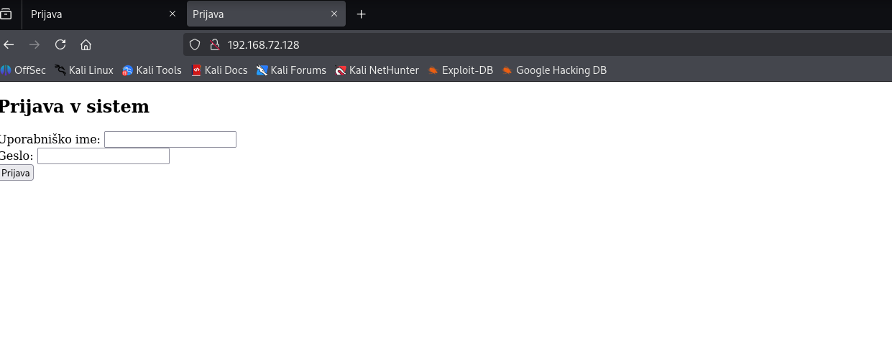
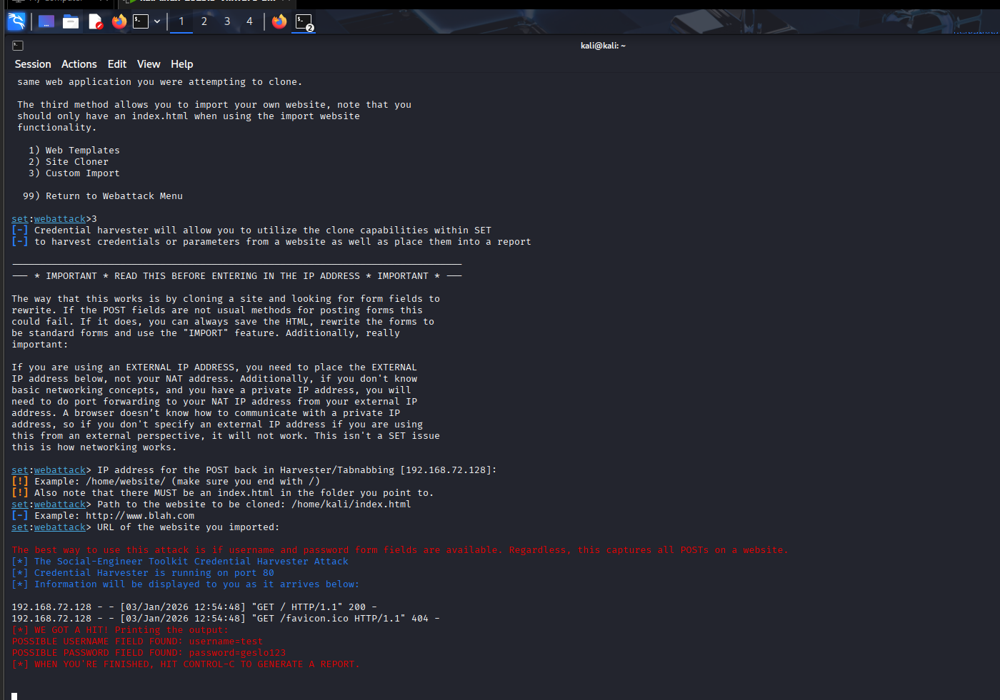

lab07
V okviru vaje je bil pripravljen preprost testni prijavni obrazec (index.html), ki je bil uporabljen kot tarča za simulacijo phishing napada. Z uporabo Social Engineering Toolkita (SET) in metode Credential Harvester (Custom Import) je SET zagnal lokalni spletni strežnik in začel poslušati na portu 80.

Ob obisku lažne prijavne strani prek brskalnika in vnosu testnih podatkov (uporabniško ime: test, geslo: geslo123) je SET v terminalu zajel vnesene prijavne podatke. To prikazuje, kako lahko uporabnik ob zaupanju lažni strani nevede razkrije svoje prijavne podatke.

Žrtev bi lahko phishing stran prepoznala po nenavadnem URL naslovu, odsotnosti HTTPS zaščite ter pomanjkanju varnostnih indikatorjev.

Katere značilnosti so značilne za phishing strani?
Phishing strani pogosto uporabljajo napačne ali sumljive URL naslove, nimajo veljavnega HTTPS certifikata, posnemajo videz legitimnih strani ter od uporabnika zahtevajo vnos prijavnih podatkov brez dodatnih varnostnih preverjanj.

Kako bi se zaščitili pred takšnim napadom?
Pred takšnimi napadi se lahko zaščitimo z rednim preverjanjem URL naslovov, uporabo upraviteljev gesel, ki preprečujejo samodejno izpolnjevanje na lažnih straneh, ter z uporabo dvofaktorske avtentikacije.

Zakaj moderne strani otežujejo takšne napade?
Moderne spletne strani uporabljajo HTTPS, varnostne mehanizme brskalnikov, preverjanje certifikatov, CAPTCHA ter večfaktorsko avtentikacijo, kar bistveno zmanjša uspešnost phishing napadov.
### Screenshoti

