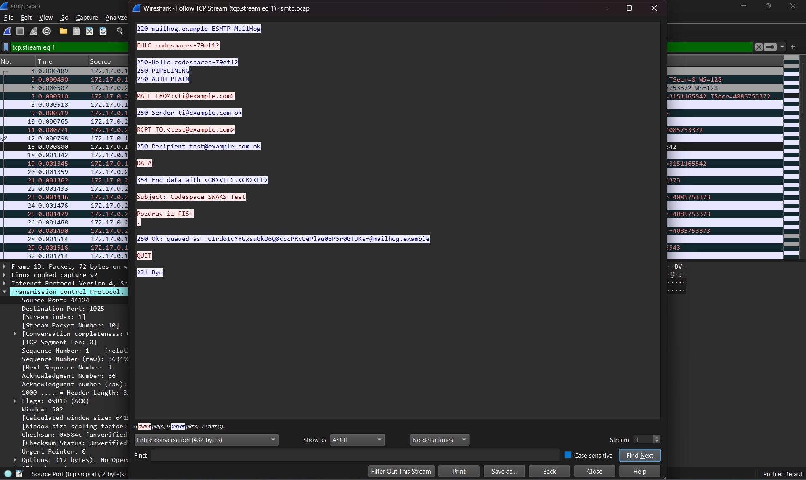
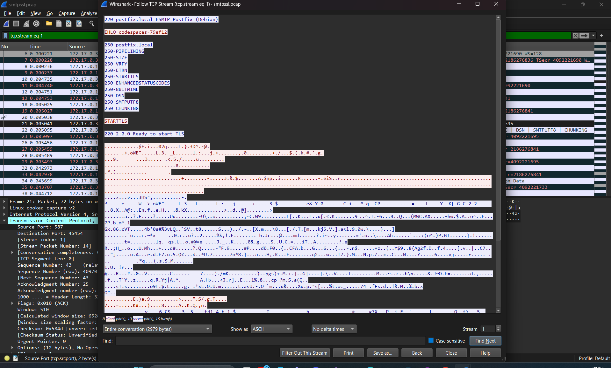

lab08
V okviru vaje je bila najprej analizirana nešifrirana SMTP komunikacija z uporabo testnega strežnika MailHog na portu 1025. Promet je bil zajet z orodjem tcpdump in analiziran v programu Wireshark. Pri analizi TCP toka (Follow TCP Stream) je bilo mogoče v berljivi obliki videti celotno SMTP sejo, vključno z ukazi SMTP (EHLO, MAIL FROM, RCPT TO), zadevo e-pošte (Subject) ter vsebino sporočila. To pomeni, da je vsebina e-pošte pri nešifrirani komunikaciji vidna vsakomur, ki ima možnost prestrezanja omrežnega prometa.

V drugem delu vaje je bila analizirana šifrirana SMTP komunikacija z uporabo STARTTLS na portu 587. Tudi v tem primeru je bil promet zajet s tcpdump in analiziran v Wiresharku. Tokrat vsebine sporočila ni bilo mogoče prebrati, saj je bila komunikacija šifrirana. Vidni so bili le osnovni podatki o povezavi, ne pa zadeva ali telo e-pošte. To jasno ponazarja pomen uporabe TLS za zaščito vsebine komunikacije.
---

### Screenshoti

**Nešifrirani SMTP (port 1025 – cleartext):**

**Šifrirani SMTP (port 587 – TLS):**

Kako bi razložili razliko med nešifriranim in šifriranim sporočilom?
Pri nešifrirani komunikaciji lahko napadalec vidi vse podatke, vključno z vsebino sporočila. Pri šifrirani komunikaciji pa so podatki zaščiteni, zato napadalec kljub prestrezanju prometa ne more razbrati vsebine.

Zakaj je preverjanje fingerprinta pri PGP pomembno?
Preverjanje fingerprinta zagotavlja, da javni ključ pripada pravi osebi, s čimer se prepreči napad tipa man-in-the-middle.

Kdaj bi uporabili PGP in kdaj Signal?
PGP je primeren za varno e-poštno komunikacijo in izmenjavo dokumentov, medtem ko je Signal bolj primeren za hitro in vsakodnevno varno sporočanje zaradi enostavne uporabe in privzetega end-to-end šifriranja.

Ali bi moralo biti end-to-end šifriranje privzeto?
Da, saj bistveno izboljša varnost in zasebnost uporabnikov. Čeprav lahko nekoliko vpliva na uporabniško izkušnjo, prednosti z vidika varovanja podatkov prevladajo.
