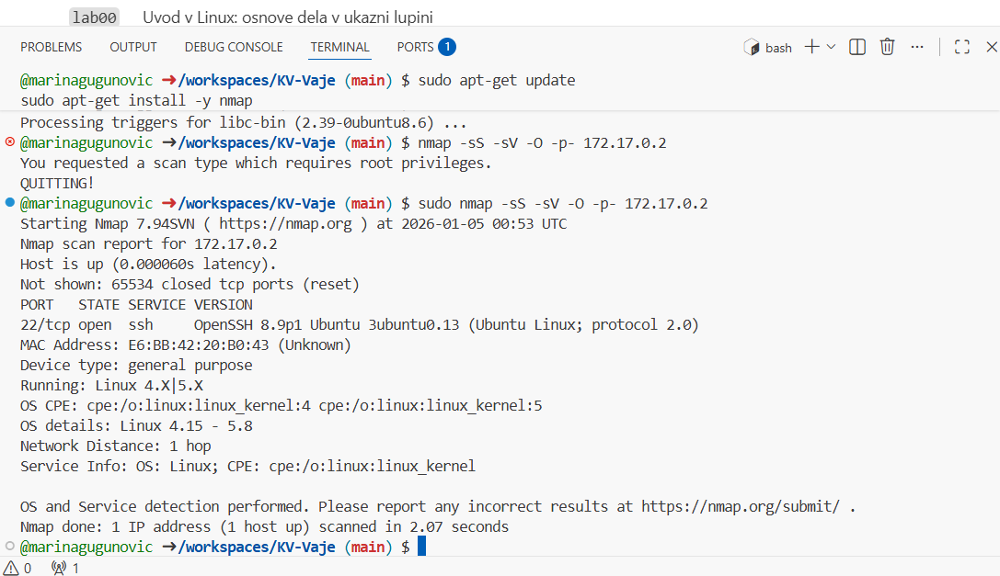
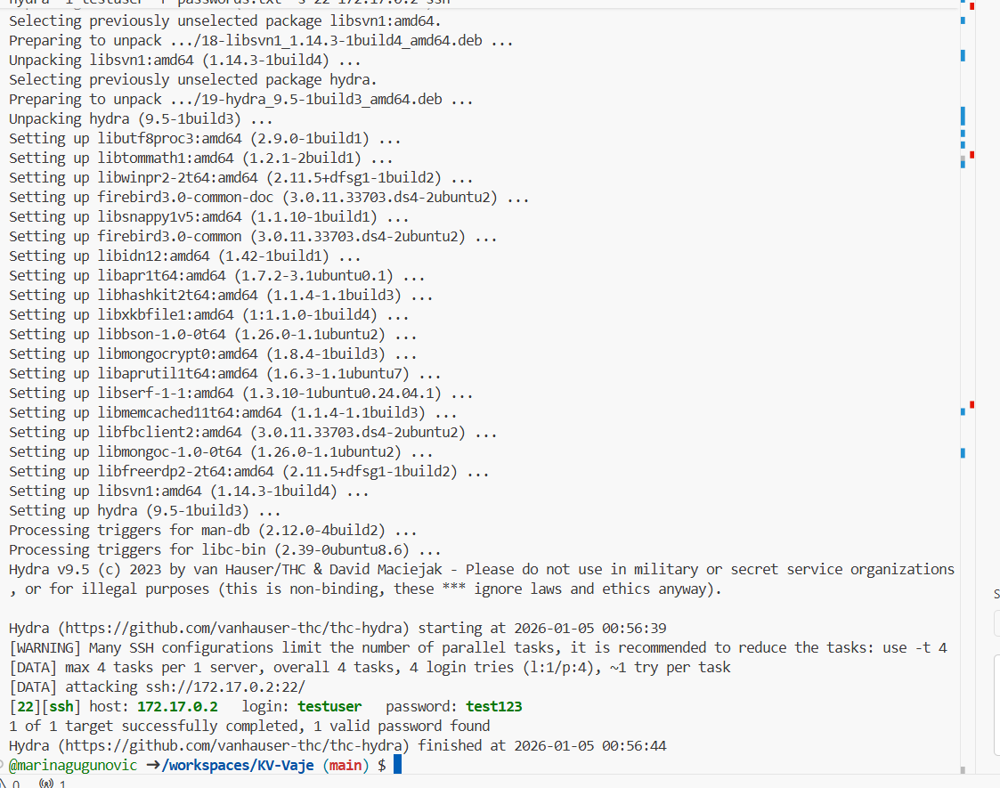

lab09
Z orodjem nmap smo preverili odprta vrata na ciljnem sistemu. Ugotovili smo, da je odprt port 22/tcp, na katerem teče storitev SSH (OpenSSH 8.9p1) na Linux operacijskem sistemu. To pomeni, da je sistem dostopen za oddaljeno prijavo, kar predstavlja potencialno tveganje, če ni ustrezno zaščiten.

Nato smo uporabili orodje Hydra za brute-force napad na SSH storitev z uporabo preprostega seznama gesel. Hydra je uspešno našla pravilno geslo za uporabnika testuser, kar dokazuje, da je uporaba šibkih gesel resna varnostna pomanjkljivost.

Ta vaja jasno pokaže, da so šibka gesla in odprti nepotrebni servisi pogost vektor napada ter da je za zaščito SSH storitev nujna uporaba močnih gesel, omejevanje poskusov prijave in dodatni varnostni mehanizmi.

Kako bi zaščitili SSH strežnik pred brute-force napadi?
SSH strežnik bi zaščitili z uporabo močnih in dolgih gesel, omejitvijo števila neuspešnih prijav ter z uporabo orodij, kot je fail2ban, ki začasno blokira IP naslov po več neuspešnih poskusih prijave.

Katere dodatne ukrepe bi priporočili?
Priporočljiva je uporaba avtentikacije z javno-zasebnimi ključi namesto gesel, sprememba privzetega SSH porta, omejitev dostopa le na določene IP naslove ter uporaba požarnega zidu (firewall).

Kako se spremeni rezultat, če uporabimo zelo močno geslo?
Če uporabimo zelo močno in unikatno geslo, brute-force napad z orodjem Hydra praviloma ne bo uspešen ali pa bi trajal nesorazmerno dolgo, kar bistveno zmanjša možnost uspešnega napada
## Dokazi izvedbe

### Nmap skeniranje odprtih vrat

### Hydra brute-force napad na SSH

